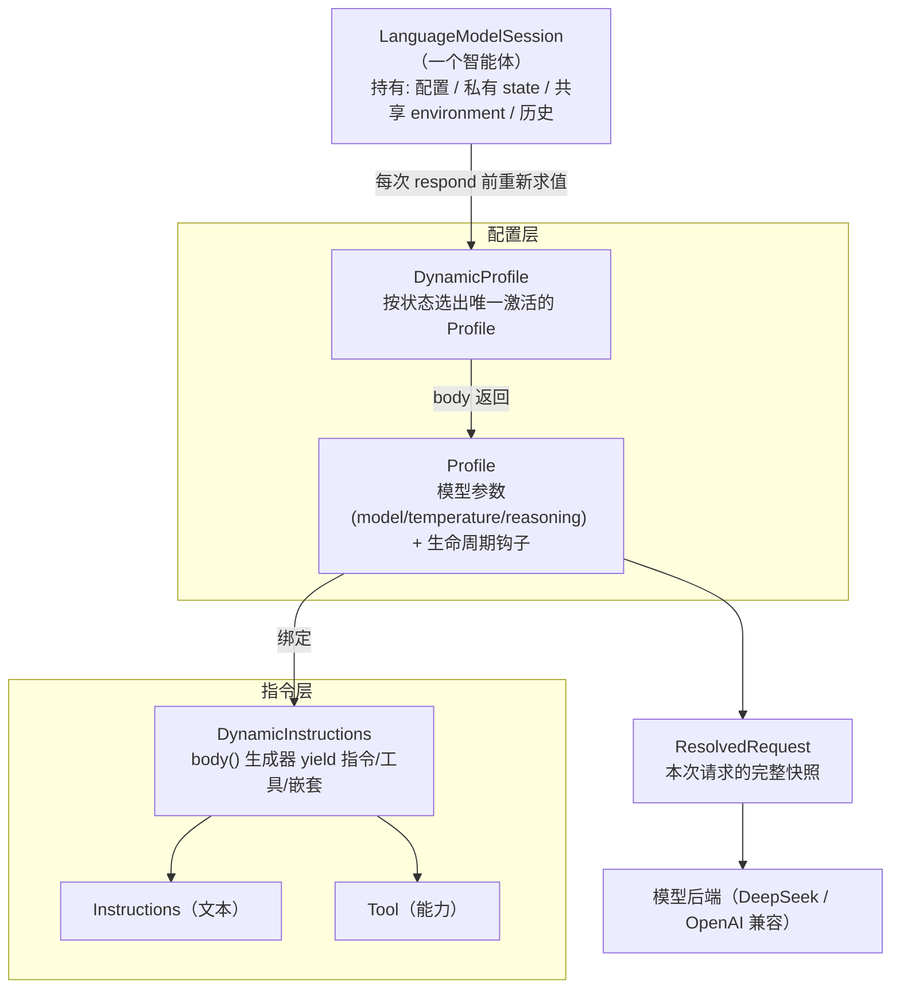
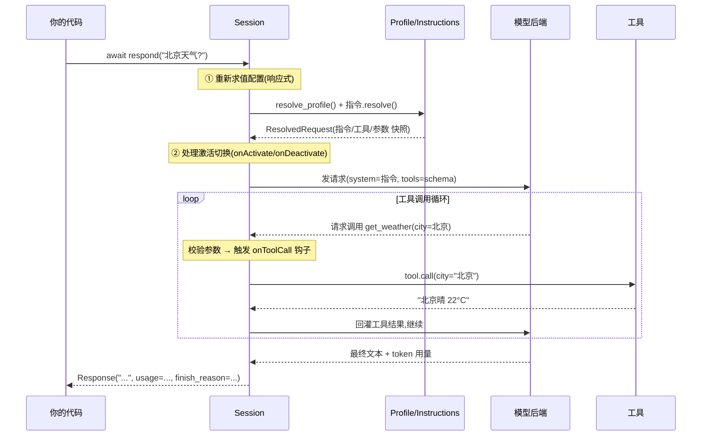
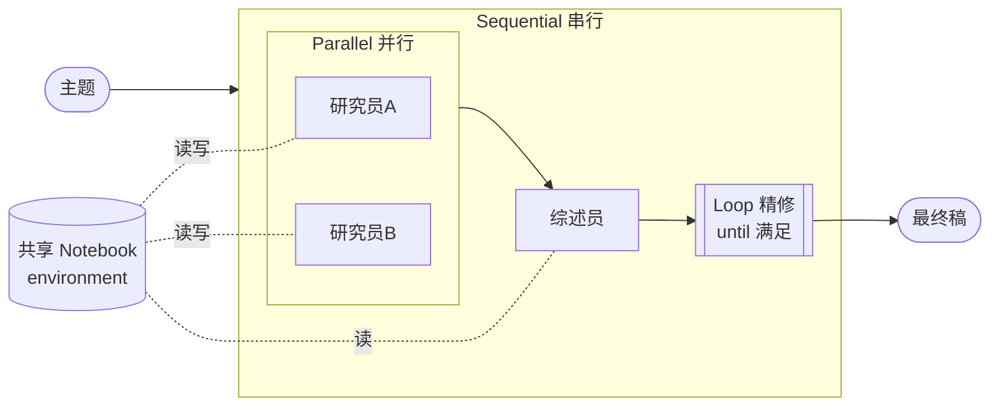
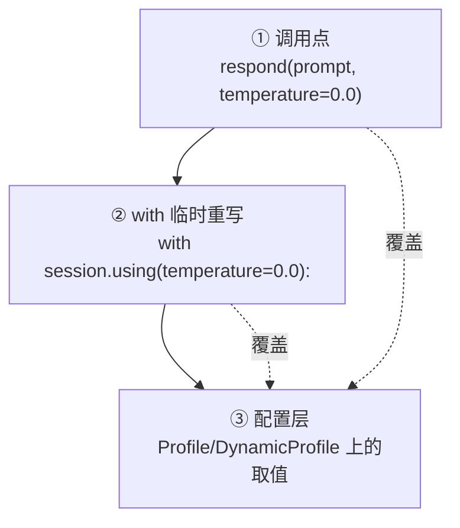
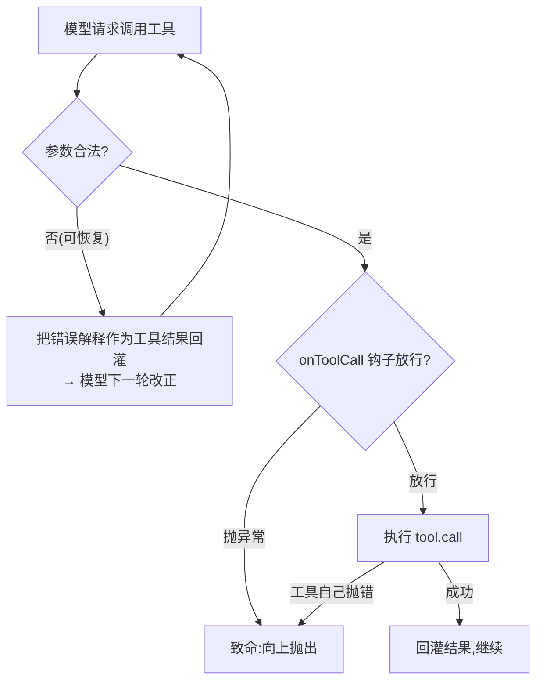

# YaoAgent 教学指南

> 面向 **Python 开发者**。本框架的设计灵感来自 Apple 的 Foundation Models / SwiftUI，
> 但**你完全不需要懂 SwiftUI**——下面所有概念都用 Python 的语言来讲。

---

## 0. 一句话定位

YaoAgent 是一个**声明式、响应式**的智能体框架：你不把提示词写死，而是**描述**
"在当前应用状态下，模型应该看到哪些指令、哪些工具、用什么参数"，框架在**每次请求前
重新求值**这个描述。应用状态变了，指令和工具就跟着变。

---

## 1. 30 秒心智模型

普通写法：把系统提示拼成一个字符串，写死。

```python
prompt = "你是助手。" + (extra if editing else "")    # 一次性、易乱、难组合
```

YaoAgent 的写法：把它写成一个**每次请求都会重新跑的函数**（用生成器声明）：

```python
class Assistant(DynamicInstructions):
    def body(self, session):              # ← 每次 respond() 前重新执行
        yield Instructions("你是助手。")
        if session.state.editing:         # ← 跟随运行时状态分支
            yield Instructions("帮用户编辑。")
```

> **关键直觉**：`body()` 不是"构造一次的模板"，而是"每次请求都重算的视图"。
> 这就是"响应式"——和 React/SwiftUI 的渲染函数同一个思路，只不过产出的是
> "给模型看的指令 + 可用工具"，而不是 UI。

---

## 2. 架构总览

三层，各管一件事，逐层收敛成一次具体请求：



| 层 | 类型 | 职责 | Python 机制 |
|---|---|---|---|
| 指令 | `DynamicInstructions` | 组合"这次要哪些指令和工具" | 生成器 `yield` |
| 配置 | `Profile` / `DynamicProfile` | "用什么模型参数" / "选哪套配置" | 不可变 dataclass / `match` |
| 会话 | `LanguageModelSession` | 持有状态、发起请求 | 普通类 + asyncio |

---

## 3. 一次 `respond()` 里发生了什么



要点：**每次** `respond()` 都从头走 ①——这就是响应式。中间 ② 的激活钩子、工具循环、
参数校验都自动发生。

---

## 4. 从 SwiftUI/Swift 到 Python（对照表）

如果你**懂** SwiftUI，这张表帮你秒懂；如果你**不懂**，看右两列即可。

| SwiftUI / Swift | 本框架 | 背后的 Python 机制 |
|---|---|---|
| `@ViewBuilder`（result builder） | `DynamicInstructions.body()` 用 `yield` | **生成器** |
| `some View` / 协议约束 | `DynamicInstructions` / `DynamicProfile` 基类 | **ABC** |
| `.padding()` 等视图修饰符 | `.temperature()` / `.on_tool_call()` | **链式方法 + 不可变 `replace`** |
| `switch` in `body` | `match` in `body` | **`match` 语句** |
| 自定义 `ViewModifier` | `DynamicProfileModifier` / `.modifier()` | **可调用对象 `Profile->Profile`** |
| `@State`（视图私有状态） | `session.state`（类型化 dataclass） | **会话持有的对象** |
| `@EnvironmentObject`（按类型注入） | `Environment(T)` 描述符 | **描述符 + 类型字典** |
| `.environmentObject(x)` | `.environment(x)` | **链式注入** |
| `HStack` / `VStack` | `parallel()` / `sequential()` | **`SessionGroup` + `asyncio.gather`** |
| 状态变 → 重新渲染 `body` | 每次 `respond` → 重新求值 `body` | **调用即重算** |

> 一句话：**Swift 的语言特性（result builder / property wrapper / 修饰符），
> 在 Python 里分别对应 生成器 / 描述符 / 链式方法。**

---

## 5. 动手：循序渐进

### 5.1 Hello world

```python
import asyncio
from yaoagent import *

class Assistant(DynamicInstructions):
    def body(self, session):
        yield Instructions("你是一个简洁的助手。")

async def main():
    session = LanguageModelSession(Assistant(), llm_config=LLMConfig.deepseek())
    print(await session.respond("用一句话介绍你自己"))

asyncio.run(main())
```

### 5.2 加工具（参数 schema 自动生成）

工具就是一个类，`call` 的**类型注解自动变成模型可见的 JSON schema**：

```python
from typing import Annotated

class GetWeather(Tool):
    name: str = "get_weather"
    description: str = "查询城市天气"
    def call(self, city: Annotated[str, "城市名"]) -> str:   # Annotated 第二项 = 字段描述
        return f'{{"city": "{city}", "temp": 22}}'

class Assistant(DynamicInstructions):
    def body(self, session):
        yield Instructions("你是天气助手，需要时调用工具。")
        yield GetWeather()        # 直接 yield 一个工具实例
```

模型请求调用工具时，框架自动校验参数、执行、把结果回灌——你什么都不用管。

### 5.3 动态指令：跟随状态分支（响应式）

```python
class Assistant(DynamicInstructions):
    def body(self, session):
        yield Instructions("你是天气助手。")
        yield GetWeather()
        if session.state.concise:            # 状态变了,下一次请求指令就变
            yield Instructions("只用一句话回答。")
```

### 5.4 Profile + 链式修饰符（模型参数）

`Profile` 把"一组指令"和"模型参数 / 钩子"绑在一起，链式书写、不可变：

```python
class MyProfile(DynamicProfile):
    def body(self, session) -> Profile:
        return (Profile(instructions=Assistant())
                .model("deepseek-v4-pro")
                .temperature(0.7)
                .reasoning("high"))
```

### 5.5 DynamicProfile 编排：按状态选配置（用 `match`）

一个智能体常有多种"模式"，每种模式有自己的指令/工具/参数。用 `match` 选一个：

```python
class KitchenAssistant(DynamicProfile):
    def body(self, session) -> Profile:
        match session.state.stage:
            case "discover":
                return Profile(instructions=DiscoverInstructions()).temperature(0.8)
            case "cooking":
                return Profile(instructions=CookingInstructions()).temperature(0.2).reasoning("high")
            case _:
                return Profile(instructions=ShoppingInstructions()).temperature(0.3)
```

切换 `session.state.stage` 时，下一次请求自动换成对应配置（并触发激活钩子，见 5.6）。

### 5.6 生命周期钩子

在请求/工具/激活的关键时刻插入回调（同步或异步均可）：

```python
Profile(instructions=Assistant())
    .on_tool_call(lambda call: print(f"调用 {call.name}"))   # 执行工具前;抛异常即拒绝
    .on_response(lambda text: log(text))                     # 拿到回复后
    .on_activate(lambda: setup())                            # 这套配置被激活时
```

### 5.7 私有 state vs 共享 environment

两层状态，边界清楚（**这是给智能体"记忆"和"共享黑板"的标准方式**）：

```python
from dataclasses import dataclass, field

# 私有状态(≈ @State):会话自己拥有,显式类型化
@dataclass
class KitchenState:
    stage: str = "discover"
    cart: list[str] = field(default_factory=list)

session = LanguageModelSession(KitchenAssistant(), llm_config=cfg, state=KitchenState())
session.state.stage = "cooking"          # 普通属性读写,类型可查

# 共享环境(≈ @EnvironmentObject):跨智能体共享,按类型注入与取用
class Notebook(EnvironmentObject):
    def __init__(self): self.findings = []

class SaveFinding(Tool):
    name: str = "save_finding"; description: str = "记一条发现"
    notebook = Environment(Notebook)     # 声明依赖,按类型注入(不进 schema)
    def call(self, text: str) -> str:
        self.notebook.findings.append(text); return "ok"

session.environment(Notebook())          # 链式注入
```

> 工具里直接用 `self.session`（框架在工具执行期间自动绑定当前会话），
> 所以 `self.session.state` / `self.notebook` 随手可得，`call` 签名保持纯净。

### 5.8 多智能体编排（`SessionGroup`）

把多个会话（每个是一个智能体）按拓扑组合，**可嵌套**：



```python
pipeline = (
    SessionGroup(
        parallel(researcher_a, researcher_b),                       # 并行调研
        synthesizer,                                                # 串行:上一步输出喂下一步
        loop(reviser, until=lambda o: "[OK]" in o, max_iters=3),    # 迭代精修
    )
    .group_style(Style.sequential)                                  # 顶层串起来
    .environment(Notebook())                                        # 环境向所有成员穿透
)
answer = await pipeline.run("研究主题")
```

- 会话与 group 都满足 `await x.run(input) -> str`，所以能像积木一样嵌套。
- group 由**三个正交维度**描述（编排约束另外两个的合法取值）：
  - **编排 `group_style`**（怎么跑）：`Style.sequential` / `Style.parallel` / `Style.loop(until=, max_iters=)`。
  - **输入 `input_style`**（收什么）：`InputStyle.pipe`（上一个喂下一个）/ `InputStyle.broadcast`（都拿原输入、靠共享 environment 通信）。
  - **输出 `output_style`**（谁的输出对外）：`OutputStyle.last` / `OutputStyle.pick(member)` / `OutputStyle.merge(fn)`。
- 每种编排自带默认（sequential = pipe+last，parallel = broadcast+merge），按需覆盖；非法组合（parallel + pipe）报错。
- 便捷函数 `sequential() / parallel() / loop()` = 编排 + 默认输入输出，最短。
- `input_style` / `output_style` 是**智能体之间的接线**；面向用户的输出（log/stream/output 投递口）是另一层 `Runtime`（见 5.10）。

```python
# 顺序跑、各拿原输入、靠共享 env 通信、返回末位成员：
SessionGroup(a, b).group_style(Style.sequential).input_style(InputStyle.broadcast).output_style(OutputStyle.last)
```

> ⚠️ **精修循环的小坑**：`Style.loop` 默认返回**最后一个成员**的输出。所以"写手↔评审"这种，
> 别让评审的判词成为结果——要么让单个 agent 自我打标记（如 `[OK]`），要么把产物
> 放进共享 `environment`、循环只用管道值做闸门，或用 `OutputStyle.pick(writer)` 指定输出位。

### 5.9 日志与实验复现

绑一个 `Trace`，框架就在每个关键节点发结构化事件；`jsonl` sink 一行一条，适合留档复现：

```python
session = LanguageModelSession(
    profile, llm_config=cfg,
    trace=Trace(jsonl("runs/exp1.jsonl"), console, level="debug"),
)
```

事件类型：`request`（含解析后的**完整配置快照**）/ `tool_call` / `tool_output` /
`response`（含 token 用量）/ `activate` / `deactivate` / `error`。
`sink` 就是个 `Callable[[dict], None]`——接 SwanLab 等只需 `Trace(lambda e: swanlab.log(e))`，
**适配器写在你的实验代码里，不进框架**。

随时导出当前配置：`session.describe()` 返回指令、工具 schema、模型参数、状态的快照。

---

## 6. 关键机制详解

### 6.1 参数三级优先级（从高到低）



### 6.2 工具校验"自愈"循环

模型把工具叫错了（坏 JSON / 未知工具 / 参数不合法）属于**可恢复**错误：框架不中断，
而是把自然语言解释**回灌**给模型让它改正；工具自身执行失败才是致命错误，向上抛出。



### 6.3 修饰符"穿透"

修饰符既能挂终态 `Profile`，也能挂外层 `DynamicProfile`，并穿透到内层：
**值类**（temperature 等）作默认值、内层优先；**钩子类**（`on_*`）跨层累加、外层先触发。

---

## 7. 在 Web 服务里用（FastAPI / Django）

纯 asyncio，和 FastAPI 异步端点天然契合；`AsyncOpenAI` 客户端按事件循环自动复用。轻量并发的纪律：

- **一对话一 session**：别把同一个可变 session 跨并发请求共享（`history`/`state` 会被写乱）。
- **共享 environment 按用户域**；全局可变就用单一写者 + `asyncio.Lock`。
- **多 worker = 多进程**：内存对象不跨进程，要横向扩展就把共享状态外置到 Redis/DB。
- **工具别阻塞事件循环**：阻塞 IO 用 `async def call` 或 `asyncio.to_thread`。

---

## 8. 速查表

| 我想… | 怎么做 |
|---|---|
| 声明指令/工具 | `class X(DynamicInstructions): def body(self, s): yield ...` |
| 加工具 | `class T(Tool)`，`call` 带类型注解（自动 schema） |
| 选模型参数 | `Profile(...).model(...).temperature(...).reasoning(...)` |
| 按状态选配置 | `class X(DynamicProfile): def body(self, s): match ...` |
| 临时改参数 | `with session.using(temperature=0): ...` |
| 钩子 | `.on_prompt/.on_response/.on_tool_call/.on_tool_output/.on_activate/.on_deactivate` |
| 私有状态 | `LanguageModelSession(..., state=MyState())` |
| 共享对象 | `class E(EnvironmentObject)`，工具里 `x = Environment(E)`，`session.environment(E())` |
| 多智能体 | `sequential(...)` / `parallel(...)` / `loop(...)` / `SessionGroup(...).group_style(...)` |
| 流式 | `async for delta in session.stream_response(...)` |
| 日志/复现 | `LanguageModelSession(..., trace=Trace(jsonl("run.jsonl"), level="debug"))` |
| 续接对话 | `LanguageModelSession(..., history=prior_messages)` |
| 错误处理 | `except ToolError/ConfigError/ModelError/YaoError as e: e.explain()` |

完整可运行示例见仓库根目录 `example.py`（能力速览 + 厨房编排）与 `example_group.py`（多智能体）。
